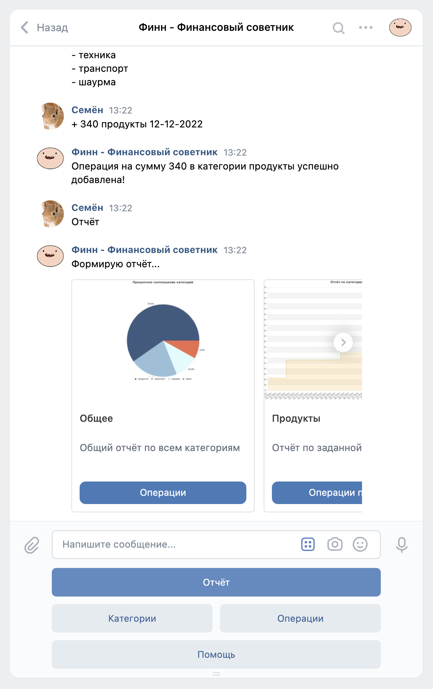
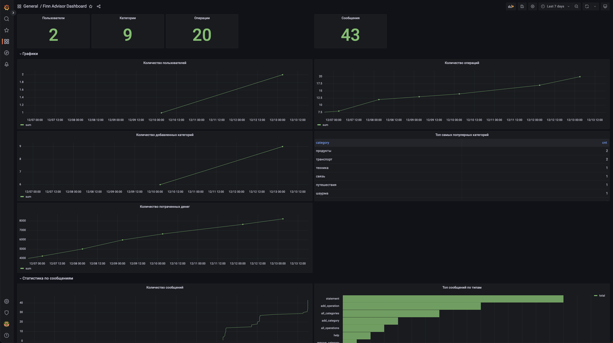

# Финн — Финансовый советник
## Описание
Финн — бот для социальной сети ВКонтакте. Найти его можно [тут](https://vk.com/finn_advisor).

Как часто вы тратите деньги, вообще не задумываясь, сколько вы тратите и на что?

Я — постоянно. И поэтому я решил создать бота, который помог бы мне ~~экономить~~ следить за моими тратами, 
помогать их анализировать, строить графики трат. Причем делать это по различным категориям.

## Технические особенности

* Бот полностью написан на PHP
* Используется база данных Postgres
* Присутствует грамотная архитектура проекта
* Присутствует кэширование при помощи Redis
* Написано более 40 unit и integration тестов на места со сложной логикой
* Присутствует автоматизация деплоя: бот будет автомагически задеплоен при релизе в GitHub
* Присутствует Grafana Dashboard с бизнес-метриками
* Проект полностью cloud-native. Например, прямо сейчас он запущен в двух репликах. И ничего не мешает запустить больше!
* Есть поддержка Liquibase миграций. Причем миграции также накатываются автоматически при деплое приложения

## Как пользоваться ботом?

На данный момент бот поддерживает следующие команды:
1) \+ сумма категория \[дата\] — добавить новую операцию (дата в формате дд-мм-гггг)
2) \+ категория — добавить новую категорию
3) \- категория — удалить категорию
4) категории — всё добавленные категории
5) отчёт — полный отчёт об операциях
6) помощь — сообщение c помощью
7) убери — убрать последнюю операцию
8) убери категория — убрать последнюю операцию заданной категории
9) операции — все операции
10) операции категория — все операции заданной категории

## Пример использования

## Grafana

На данный момент у нас нет никакой возможности хостить где-либо Grafana так, чтобы каждый мог получить доступ к Dashboard.
Поэтому вы можете захостить Grafana у себя локально и импортировать себе файл [grafana.json](grafana.json), который
содержит полную настройку Grafana со всеми уже готовыми графиками.

